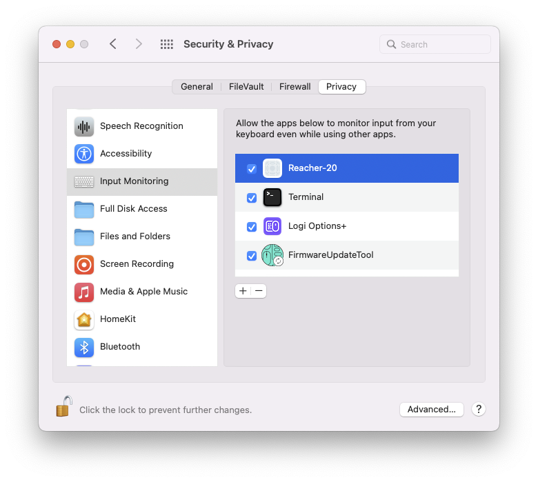

# drlnd_p2_continuous-control

## Getting Started

1. First you'll need to download the unity environment.
- **_Version 1: One (1) Agent_**
    - Linux: [click here](https://s3-us-west-1.amazonaws.com/udacity-drlnd/P2/Reacher/one_agent/Reacher_Linux.zip)
    - Mac OSX: [click here](https://s3-us-west-1.amazonaws.com/udacity-drlnd/P2/Reacher/one_agent/Reacher.app.zip)
    - Windows (32-bit): [click here](https://s3-us-west-1.amazonaws.com/udacity-drlnd/P2/Reacher/one_agent/Reacher_Windows_x86.zip)
    - Windows (64-bit): [click here](https://s3-us-west-1.amazonaws.com/udacity-drlnd/P2/Reacher/one_agent/Reacher_Windows_x86_64.zip)

- **_Version 2: Twenty (20) Agents_**
    - Linux: [click here](https://s3-us-west-1.amazonaws.com/udacity-drlnd/P2/Reacher/Reacher_Linux.zip)
    - Mac OSX: [click here](https://s3-us-west-1.amazonaws.com/udacity-drlnd/P2/Reacher/Reacher.app.zip)
    - Windows (32-bit): [click here](https://s3-us-west-1.amazonaws.com/udacity-drlnd/P2/Reacher/Reacher_Windows_x86.zip)
    - Windows (64-bit): [click here](https://s3-us-west-1.amazonaws.com/udacity-drlnd/P2/Reacher/Reacher_Windows_x86_64.zip)
and put the file in the 'p1_navigation' folder

**NOTE for Macbook users**: double click the "Reacher" app. If you see the message *"Reacher" Cannot Be Opened Because the Developer Cannot be Verified*. [Than Apple doesnt trust the app](https://www.lifewire.com/fix-developer-cannot-be-verified-error-5183898). I fixed it by allowing it access.



To set up your python environment to run the code in this repository, follow the instructions below.

2. Create (and activate) a new environment with Python 3.6.

	- __Linux__ or __Mac__: 
	```bash
	conda create --name drlnd_p2_continuous-control python=3.6
    source activate drlnd_p2_continuous-control
	```
	- __Windows__: 
	```bash
	conda create --name drlnd_p2_continuous-control python=3.6 
	activate drlnd_p2_continuous-control
	```
	
3. Clone the repository (if you haven't already!), and navigate to the `python/` folder.  Then, install several dependencies.
```bash
git clone https://github.com/willembressers/drlnd_p2_continuous-control.git
cd python
pip install .
```

4. Create an [IPython kernel](http://ipython.readthedocs.io/en/stable/install/kernel_install.html) for the `drlnd` environment.  
```bash
python -m ipykernel install --user --name drlnd_p2_continuous-control --display-name "drlnd_p2_continuous-control"
```

## Instructions

1. Start the notebook
```bash
cd ..
jupyter notebook
```

2. Before running code in a notebook, change the kernel to match the `drlnd_p2_continuous-control` environment by using the drop-down `Kernel` menu. 


3. Now you can 'run all' cell's, which will train the agent, and once trained it will play the game (once).

## Want to learn more?